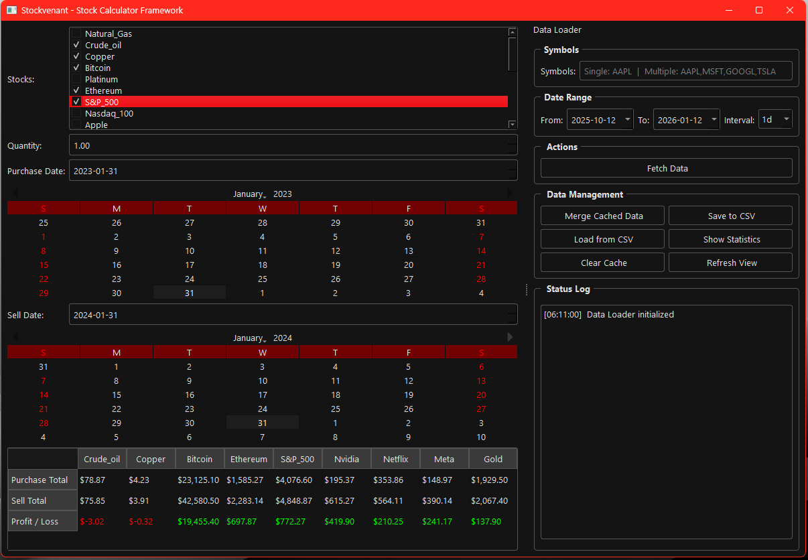

# Stockvenant.
 is a lightweight and efficient Framework for managing and manipulating stock market data in Python. It provides tools for data retrieval, analysis, and visualization, making it easier for developers and analysts to work with financial datasets.


## Libraries
- Numpy
- Pandas
- Python-dateutil
- PyQt6
- YFinance
- Requests

## Installation
### 1. Clone the Repository

### 2. Install Dependencies

```bash
pip install -r requirements.txt
```
### 3. Run the Application

```bash
python main.py
```
## Stockvenant 



